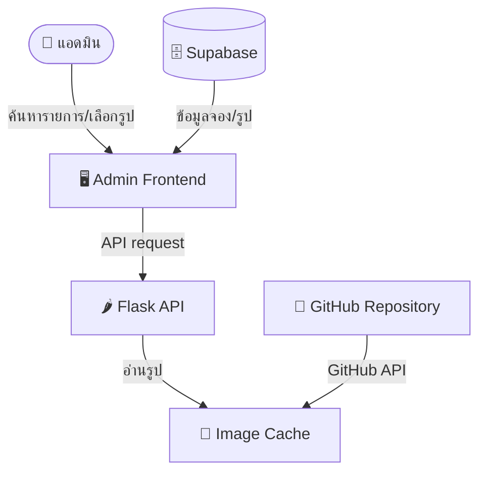

# 🕉️ Siamganesh Online Backend

<div align="center">

[](https://www.python.org/)
[](https://flask.palletsprojects.com/)
[](https://supabase.com/)

**ระบบ Backend (Flask) สำหรับจัดการภาพพิธีกรรมทางศาสนา/ความเชื่อ**
รองรับการแยกทำงานตามเพจต้นทางแบบ Multi-Page ได้แก่ **มหาบูชา**, **มูเตทีม**, **มูเตทีม (งานพิธี)**, **สยามคเณศ (ลาว)** และ **สยามคเณศ (ราชประสงค์)** พร้อมผสานการทำงานกับ Supabase

</div>

---

## 🌟 ฟีเจอร์เด่น (Key Features)

*   **Manual Image Management**: แอดมินค้นหา ดาวน์โหลด และจัดการภาพพิธีกรรมจากระบบหลังบ้าน
*   **Supabase Database Integration**: จัดเก็บและอ่านข้อมูลการจองและข้อมูลผู้ศรัทธาสำหรับการทำงานของแอดมิน
*   **In-Memory Image Caching**: ลดความหน่วงและประหยัด API Rate Limit ของ GitHub ด้วยระบบ Cache ชื่อไฟล์และโครงสร้าง URL ภาพในหน่วยความจำ
*   **Rich API Endpoints**: มี API เพื่อใช้ควบคุมและทำงานร่วมกับระบบภายนอก เช่น การอัปโหลดภาพด้วย Base64 การสืบค้นภาพ และการรีโหลด Cache

---

## 🏗️ สถาปัตยกรรมระบบ (System Architecture)



> **หมายเหตุ**: `core/owners.py` เป็น registry กลางของทุก owner/page ในระบบ (`mahabucha`, `muteteam`, `muteteam_ceremony`, `laos`, `ratchaprasong`) ใช้แทนที่การ hardcode รายชื่อ owner กระจายอยู่หลายจุด — ดูหัวข้อ [🌍 การเพิ่มเพจ/แบรนด์ใหม่](#-การเพิ่มเพจแบรนด์ใหม่-adding-a-new-owner) ด้านล่าง

---

## 📂 โครงสร้างโปรเจกต์ (Project Structure)

```bash
siamganesh-online-backend/
├── app.py              # แอปพลิเคชันหลัก (Flask): สร้าง app, ผูก blueprint, ตั้ง scheduler
├── config.py           # โหลด Environment Variables ทั้งหมด
├── core/
│   ├── owners.py       # 📇 Registry กลางของทุก owner/page (mahabucha, muteteam, muteteam_ceremony, laos, ratchaprasong)
│   ├── blueprints/      # Route handlers (images, notifications, system)
│   ├── services/       # Business logic (image_cache_service, notification_service, ...)
│   ├── clients/         # External API clients (line_client, github_client)
│   ├── repositories/    # Supabase query layer
│   └── schemas.py       # Pydantic request-validation schemas ต่อ endpoint
├── requirements.txt    # รายการ dependencies ที่จำเป็นสำหรับรันระบบ
├── README.md           # เอกสารแนะนำโปรเจกต์และการใช้งาน
└── images/             # โฟลเดอร์ marker (.keep) เดิมเท่านั้น — รูปทั้งหมดอยู่ใน Supabase Storage
```

> รูปภาพทุกเพจอยู่ใน Supabase Storage ที่ `portfolio/image-library/<owner>/`; GitHub ใช้เก็บ source code เท่านั้น

---

## ⚙️ การตั้งค่าระบบ (Configuration & Env)

โปรเจกต์นี้ทำงานโดยใช้ค่ากำหนดต่าง ๆ ผ่าน Environment Variables ด้านล่างนี้คือรายการตัวแปรที่จำเป็นต้องกำหนดก่อนเริ่มทำงาน:

| ชื่อตัวแปร | คำอธิบายเพิ่มเติม | ตัวอย่างค่า |
|:---|:---|:---|
| `SUPABASE_URL` | URL ของโครงการ Supabase ของคุณ | `https://xxxx.supabase.co` |
| `SUPABASE_KEY` | Supabase Service Role Key สำหรับจัดการ Supabase Storage | `eyJhbGciOi...` |
| `LINE_CHANNEL_ACCESS_TOKEN_MAHABUCHA` | LINE Channel Access Token — ใช้ร่วมกันทุกเพจ (มหาบูชา/มูเตทีม/มูเตทีม งานพิธี/ลาว/ราชประสงค์) ตั้งแต่รวม LINE OA เป็นช่องทางเดียว ข้อความแยกความแตกต่างด้วยชื่อเพจในเนื้อหาแทน | `Rws+...` |
| `LINE_GROUP_ID_MAHABUCHA` | LINE Group ID ปลายทางแจ้งเตือน — ใช้กลุ่มเดียวกันทุกเพจเช่นกัน | `Cxxxxxxxxxxxx` |

> 🌍 **การเพิ่มเพจ/แบรนด์ใหม่ (Adding a new owner)**: เพิ่ม entry ใหม่ใน `OWNERS` dict ของ `core/owners.py` เพียงจุดเดียว ไม่ต้องแก้ if/elif กระจายในหลายไฟล์ (LINE token/group ใช้ร่วมกันทุกเพจ)

> `GITHUB_TOKEN` ไม่ได้ใช้โดย backend ที่รันจริงแล้ว มีเฉพาะ script ย้ายข้อมูลเก่าใน `scripts/migrate_github_image_library_to_supabase.py` ซึ่งไม่ถูกเรียกเมื่อรันแอป

---

## 🖼️ การค้นหาและส่งภาพ

การค้นหารูปด้วยรหัสทำผ่านหน้าแอดมินเท่านั้น ระบบไม่มีการรับหรือส่งข้อความผ่าน Facebook API

หน้าแอดมินใช้ข้อความสำเร็จรูปฝั่ง frontend เพื่อให้แอดมินคัดลอกส่งลูกค้าเอง ระบบนี้ไม่มี API สร้างข้อความด้วย AI และไม่มีการส่งข้อความหาลูกค้าอัตโนมัติ

## ⏰ แจ้งเตือน LINE ตามกำหนดเวลา

งานแจ้งเตือนตามเวลา (เวลา Asia/Bangkok) ส่งข้อความไปยัง LINE Group เดียวของระบบ:

- เวลา 16:00 เฉพาะ **วันก่อนวันจัดพิธี 1 วัน** และ **วันจัดพิธี**: แจ้งเตือนคิวที่ยังค้างปริ้นของงานนั้น พร้อมชื่องานพิธีและจำนวนรายการแยกตามราคาที่ลูกค้าเลือก; ทั้งสองครั้ง หากไม่มีค้างปริ้น จะส่งข้อความยืนยันว่าไม่มีค้างปริ้น
- ทุกวัน 21:00: สรุปยอดงานพิธีของมหาบูชา, มูเตทีมงานพิธี, ลาว และราชประสงค์
- ทุกวัน 21:00 หลังวันจัดพิธี: สำหรับมหาบูชา, มูเตทีม (งานพิธี), ลาว และราชประสงค์ สามารถเปิด “ติดตามคิวรอส่งภาพ” รายเพจได้ ระบบจะแจ้งจำนวนลูกค้าที่ยังอยู่สถานะ `ready_to_send` ต่อเนื่องจนหมด และแจ้งปิดคิวหนึ่งครั้งเมื่อส่งภาพครบ
- วันสุดท้ายของเดือน 21:00: สรุปยอดรายเดือนของมูเตทีม

ชื่อเพจที่อยู่ในข้อความ LINE ทุกประเภท (คิวค้างปริ้น, สรุปยอด, ติดตาม/ปิดคิวส่งภาพ) อ่านจาก `system_settings.page_configuration` ซึ่งเป็นค่ากลางเดียวกับเมนู **ตั้งค่าเพจ**. สถานะเปิด/ปิดจากค่านี้เป็นเงื่อนไขแรกของแต่ละงาน: เพจที่ปิดจะไม่ส่ง automation ใด ๆ. หากอ่านค่ากลางไม่ได้ ระบบจึงใช้ชื่อมาตรฐานใน registry เป็น fallback เพื่อไม่ให้งานหยุดทำงาน.

แต่ละงานตรวจค่าเปิด/ปิดจาก `system_settings` ก่อนส่ง จึงควบคุมได้จากหน้า Settings โดยไม่เกี่ยวกับระบบข้อความลูกค้า

### การตั้งเวลา: Render Cron Jobs (ไม่ใช่ scheduler ในเว็บ)

เดิมงานเหล่านี้รันด้วย APScheduler ในตัวโปรเซสเว็บเดียวกับที่รับ HTTP request — ปัญหาคือถ้า gunicorn worker ถูกฆ่า/รีสตาร์ท (เช่น request ที่ทำงานช้ากว่าค่า `--timeout` ของ gunicorn) thread ของ scheduler จะหายไปเงียบๆ โดยไม่มี error log ใดๆ ทำให้ automation ไม่ส่งในวันนั้นโดยไม่มีร่องรอย (เหตุการณ์นี้เคยเกิดขึ้นจริง — ดู incident วันที่ 2026-08-03)

ตอนนี้ย้ายมาใช้ **Render Cron Jobs** แทน ซึ่งเป็นฟีเจอร์แยกต่างหากของ Render ที่รัน process สั้นๆ ตามตารางเวลาโดยไม่ผูกกับ web service เลย งานทั้งหมดเรียกผ่าน `cron_jobs.py` ที่ root ของ repo นี้:

| Cron Job (ตั้งใน Render Dashboard) | Schedule (UTC) | Command |
|:---|:---|:---|
| `siamganesh-cron-afternoon` | `0 9 * * *` (16:00 ไทย) | `python cron_jobs.py afternoon` |
| `siamganesh-cron-evening` | `0 14 * * *` (21:00 ไทย) | `python cron_jobs.py evening` |
| `siamganesh-cron-monthly` | `0 14 28-31 * *` (21:00 ไทย, วันที่ 28-31) | `python cron_jobs.py monthly` |

> `monthly` ไม่ได้ตั้งเป็น "วันสุดท้ายของเดือน" ตรงๆ เพราะ cron syntax มาตรฐานไม่มีฟิลด์แบบนั้น จึงตั้งให้รันทุกวันที่ 28-31 แล้วให้ `cron_jobs.py` เช็คเองว่าเป็นวันสุดท้ายของเดือนจริงหรือไม่ (ถ้าไม่ใช่จะ skip)

**ขั้นตอนสร้างใน Render**: New → Cron Job → เลือก Repository เดียวกับ Web Service นี้ → ตั้ง Build Command เป็น `pip install -r requirements.txt` → ใส่ Schedule และ Start Command ตามตารางด้านบน → ทำซ้ำ 3 ครั้งสำหรับทั้ง 3 job

**สำคัญ — ตัวแปร Environment ต้องตั้งแยกใหม่**: Render Cron Job แต่ละตัวมีชุด Environment Variables เป็นของตัวเอง **ไม่ได้ใช้ร่วมกับ Web Service โดยอัตโนมัติ** ต้องเข้าไปตั้งค่าในเมนู Environment ของแต่ละ Cron Job ให้ตรงกับของ Web Service (`siamganesh-online-backend`) ทั้งหมดนี้:

- `SUPABASE_URL`
- `SUPABASE_KEY`
- `LINE_CHANNEL_ACCESS_TOKEN_MAHABUCHA`
- `LINE_GROUP_ID_MAHABUCHA`
- `ALLOWED_ORIGINS` — ไม่เกี่ยวกับ cron โดยตรง แต่ `config.py` เช็คค่านี้ตอน import และจะ raise error ทันทีถ้าไม่ได้ตั้ง (ทำให้ cron job ล้มเหลวหมดทั้ง process แม้ logic จริงจะไม่ต้องใช้ CORS เลย) ตั้งเป็นค่าเดียวกับ Web Service ได้เลย

วิธีที่ปลอดภัยที่สุดคือใช้ **Render Environment Group** (Dashboard → Env Groups) ผูก 4-5 ตัวแปรนี้ไว้ที่เดียว แล้ว link เข้ากับทั้ง Web Service และ Cron Job ทั้ง 3 ตัว — จะได้ไม่ต้อง copy ค่าด้วยมือและพลาดพิมพ์ key ผิด/ค่าไม่ตรงกันระหว่าง service

**เช็คหลัง deploy**: หลังสร้าง Cron Job ครบแล้ว ให้กด "Trigger Run" ทดสอบ 1 ครั้งต่อ job (Render มีปุ่มนี้ให้กดรันทันทีโดยไม่ต้องรอถึงเวลา) แล้วดู Logs ของ Cron Job นั้นว่ามีบรรทัด `[TIMER]` ขึ้นต้นให้เห็นหรือไม่ (ถ้าไม่มีเลย แปลว่า key ไม่ตรง/ค่าง่ายหรือ import ล้มเหลวตั้งแต่ต้น)

---

## 🚀 การเริ่มต้นใช้งาน (Local Development)

### 1. ติดตั้ง Dependencies
เปิดเทอร์มินัลในโฟลเดอร์โปรเจกต์ จากนั้นรันคำสั่งสร้าง Virtual Environment และติดตั้ง library ที่จำเป็น:

```bash
# สร้างและเปิดใช้งาน Virtual Environment (ทางเลือก)
python3 -m venv venv
source venv/bin/activate  # สำหรับ Mac/Linux
# venv\Scripts\activate   # สำหรับ Windows

# ติดตั้งแพ็กเกจ
pip install -r requirements.txt
```

### 2. ตั้งค่า Environment Variables
บนระบบปฏิบัติการ Mac / Linux คุณสามารถ Export ตัวแปรได้ดังนี้:

```bash
export SUPABASE_URL="your_supabase_url"
export SUPABASE_KEY="your_supabase_key"
```

*(สำหรับระบบปฏิบัติการ Windows ให้ใช้คำสั่ง `set` แทน `export`)*

### 3. รันระบบสำหรับการพัฒนา
```bash
python app.py
```
เมื่อรันสำเร็จ ระบบจะเริ่มทำงานที่ `http://127.0.0.1:5000` โดยจะดึงข้อมูลรูปภาพจาก GitHub มาบันทึกใน Cache เป็นครั้งแรกโดยอัตโนมัติ

---

## 🌐 API Reference (รายการ Endpoint)

### 1. ค้นหารูปภาพตามรหัส
*   **Endpoint**: `/api/search`
*   **Method**: `GET`
*   **Parameters**:
    *   `page`: ระบุ `mahabucha`, `muteteam`, `muteteam_ceremony`, `laos` หรือ `ratchaprasong`
    *   `code`: รหัสที่ต้องการค้นหา
*   **ตัวอย่างการเรียก**:
    `GET http://localhost:5000/api/search?page=muteteam&code=260519142238`
*   **ผลลัพธ์ (พบข้อมูล):**
    ```json
    {
      "found": true,
      "results": [
        {
          "code": "260519142238_1",
          "image_url": "https://raw.githubusercontent.com/mrtharatoy/siamganesh-online-backend/main/images/muteteam/260519142238_1.webp"
        }
      ],
      "count": 1
    }
    ```

---

### 3. อัปโหลดภาพพิธีเข้าระบบ (GitHub Storage)
*   **Endpoint**: `/api/upload-image`
*   **Method**: `POST`
*   **Request Body**:
    ```json
    {
      "booking_code": "260519142238",
      "images": [
        { "index": 1, "ext": "webp", "data": "base64_encoded_image_data_here" },
        { "index": 2, "ext": "webp", "data": "base64_encoded_image_data_here" }
      ]
    }
    ```
*   **ผลลัพธ์ (สำเร็จ):**
    ```json
    {
      "success": true,
      "uploaded": ["260519142238_1.webp", "260519142238_2.webp"],
      "errors": [],
      "message": "อัปโหลดสำเร็จ 2/2 รูป"
    }
    ```

---

### 4. รีโหลด Cache รูปภาพจาก GitHub
สั่งการอัปเดตข้อมูลรายชื่อไฟล์ภาพจาก GitHub Repository ใหม่ด้วยวิธีเบื้องหลัง (Background Thread)

*   **Endpoint**: `/api/reload`
*   **Method**: `POST`
*   **ผลลัพธ์:**
    ```json
    {
      "message": "กำลัง reload cache..."
    }
    ```

---

## 📦 การนำขึ้นใช้งานจริง (Production Deployment)

ในการทำงานจริง แนะนำให้รันแอปพลิเคชันด้วย **WSGI Server** เช่น `gunicorn` เพื่อเพิ่มประสิทธิภาพและความเสถียรในการรองรับ Concurrent Requests

### ตัวอย่างการติดตั้งและเริ่มทำงานด้วย Gunicorn:
```bash
# ติดตั้ง Gunicorn
pip install gunicorn

# รันเซิร์ฟเวอร์ Binding ไปยังพอร์ตที่ต้องการ
gunicorn app:app --bind 0.0.0.0:5000 --workers 4 --threads 2 --timeout 60
```

### การ Deploy บน Cloud Platforms:
*   **Render**: แพลตฟอร์มที่ใช้รัน backend นี้จริงในปัจจุบัน เชื่อมต่อ Repository นี้ และตั้งค่า environment variables ในเมนู Dashboard (https://dashboard.render.com) และกำหนด Start Command เป็น:
    `gunicorn app:app --bind 0.0.0.0:$PORT`
*   **Docker Container**: สามารถสร้าง `Dockerfile` สำหรับติดตั้ง dependencies และสั่งรันเซิร์ฟเวอร์เพื่อให้มีความสม่ำเสมอในทุกสภาพแวดล้อมระบบปฏิบัติการ

---

## 🛠️ รายการ Libraries ที่ใช้ (Dependencies)

*   **Flask & Flask-CORS**: จัดการ Web Server และ Cross-Origin Resource Sharing
*   **requests**: จัดการ HTTP Calls ส่งภาพและเชื่อมประสานกับ GitHub API และ Supabase API
*   **gunicorn**: รันเว็บแอปเพื่อเพิ่มความสามารถของเกตเวย์เซิร์ฟเวอร์ในขั้นตอนการใช้งานจริง (Production)

---

## ⚖️ สัญญาอนุญาต (License)

โปรเจกต์นี้ได้รับการพัฒนาเพื่ออำนวยความสะดวกในธุรกิจและการจัดการภายในของแบรนด์ **สยามคเณศ (Siamganesh)**
