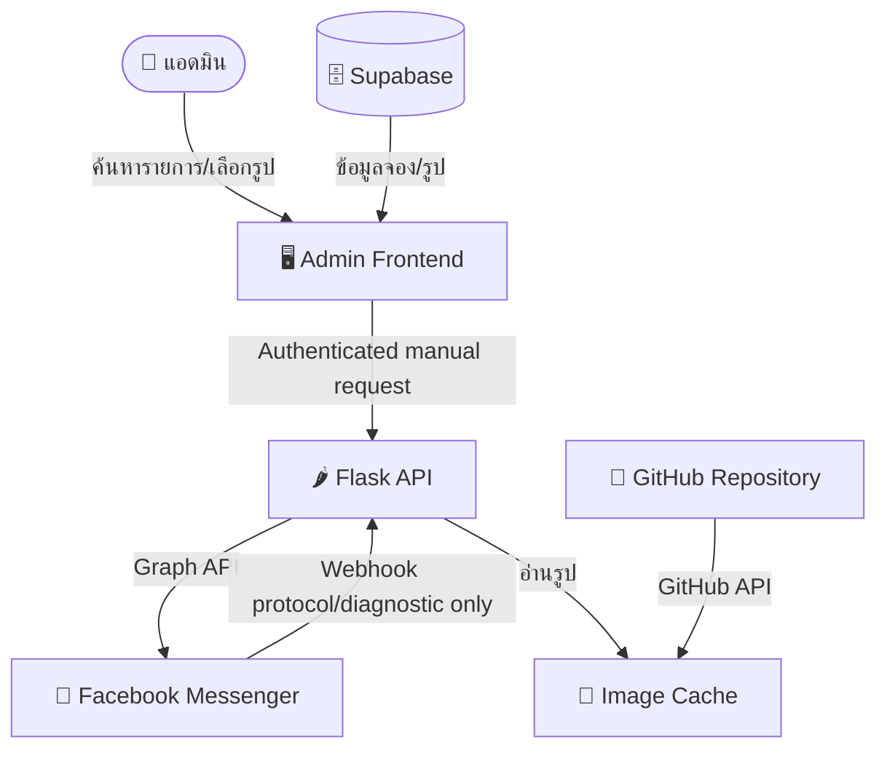

# 🕉️ Siamganesh Online Backend

<div align="center">

[](https://www.python.org/)
[](https://flask.palletsprojects.com/)
[](https://supabase.com/)
[](https://developers.facebook.com/)

**ระบบ Backend อัตโนมัติ (Flask) สำหรับจัดการและส่งมอบภาพพิธีกรรมทางศาสนา/ความเชื่อ ผ่าน Facebook Messenger Webhook**  
รองรับการแยกทำงานตามเพจต้นทางแบบ Multi-Page ได้แก่ **มหาบูชา**, **มูเตทีม**, **มูเตทีม (งานพิธี)**, **สยามคเณศ (ลาว)** และ **สยามคเณศ (ราชประสงค์)** พร้อมผสานการทำงานกับ Supabase

</div>

---

## 🌟 ฟีเจอร์เด่น (Key Features)

*   **Multi-Page Messenger Support**: รับข้อความ Webhook จาก Facebook Messenger และแยกกระบวนการทำงานตาม Page ID ได้อย่างแม่นยำ
*   **Manual Image Delivery**: แอดมินค้นหาและส่งภาพถาดถวาย/ภาพพิธีกรรมให้ลูกค้าผ่านเครื่องมือที่ยืนยันสิทธิ์แล้ว
*   **Supabase Database Integration**: จัดเก็บและอ่านข้อมูลการจองและข้อมูลผู้ศรัทธาสำหรับการทำงานของแอดมิน
*   **In-Memory Image Caching**: ลดความหน่วงและประหยัด API Rate Limit ของ GitHub ด้วยระบบ Cache ชื่อไฟล์และโครงสร้าง URL ภาพในหน่วยความจำ
*   **Rich API Endpoints**: มี API เพื่อใช้ควบคุมและทำงานร่วมกับระบบภายนอก เช่น การอัปโหลดภาพด้วย Base64 การสืบค้นภาพ และการรีโหลด Cache

---

## 🏗️ สถาปัตยกรรมระบบ (System Architecture)



> **หมายเหตุ**: `core/owners.py` เป็น registry กลางของทุก owner/page ในระบบ (`mahabucha`, `muteteam`, `muteteam_ceremony`, `laos`, `ratchaprasong`) ใช้แทนที่การ hardcode รายชื่อ owner กระจายอยู่หลายจุด — ดูหัวข้อ [🌍 การเพิ่มเพจ/แบรนด์ใหม่](#-การเพิ่มเพจแบรนด์ใหม่-adding-a-new-owner) ด้านล่าง

---

## 📂 โครงสร้างโปรเจกต์ (Project Structure)

```bash
siamganesh-online-backend/
├── app.py              # แอปพลิเคชันหลัก (Flask): สร้าง app, ผูก blueprint, ตั้ง scheduler
├── config.py           # โหลด Environment Variables ทั้งหมด
├── core/
│   ├── owners.py       # 📇 Registry กลางของทุก owner/page (mahabucha, muteteam, muteteam_ceremony, laos, ratchaprasong)
│   ├── blueprints/      # Route handlers (ai, images, messenger, notifications, system)
│   ├── services/       # Business logic (image_cache_service, notification_service, ...)
│   ├── clients/         # External API clients (facebook_client, line_client, github_client)
│   ├── repositories/    # Supabase query layer
│   └── schemas.py       # Pydantic request-validation schemas ต่อ endpoint
├── requirements.txt    # รายการ dependencies ที่จำเป็นสำหรับรันระบบ
├── README.md           # เอกสารแนะนำโปรเจกต์และการใช้งาน
└── images/             # โฟลเดอร์เก็บภาพถาดถวายและผลลัพธ์พิธีกรรม (Sync ไปยัง GitHub — เฉพาะ owner ที่ใช้ GitHub storage)
    ├── mahabucha/      # ภาพถาดถวายของเพจมหาบูชา (จัดเก็บในชื่อ deity_code.jpg)
    └── muteteam/       # ภาพถาดถวายของเพจมูเตทีม (จัดเก็บในชื่อ booking_code_index.webp)
```

> เพจ **สยามคเณศ (ลาว)** และ **สยามคเณศ (ราชประสงค์)** ใช้ Supabase Storage แทน GitHub สำหรับเก็บภาพ (เหมือนมหาบูชา) จึงไม่มีโฟลเดอร์ของตัวเองใน `images/`

---

## ⚙️ การตั้งค่าระบบ (Configuration & Env)

โปรเจกต์นี้ทำงานโดยใช้ค่ากำหนดต่าง ๆ ผ่าน Environment Variables ด้านล่างนี้คือรายการตัวแปรที่จำเป็นต้องกำหนดก่อนเริ่มทำงาน:

| ชื่อตัวแปร | คำอธิบายเพิ่มเติม | ตัวอย่างค่า |
|:---|:---|:---|
| `MAHABUCHA_PAGE_ID` | หมายเลข ID ของ Facebook Page (มหาบูชา) | `102938475612345` |
| `MAHABUCHA_TOKEN` | Page Access Token ที่ได้จาก Facebook Developer (มหาบูชา) | `EAABw...` |
| `MUTETEAM_PAGE_ID` | หมายเลข ID ของ Facebook Page (มูเตทีม) | `564738291012345` |
| `MUTETEAM_TOKEN` | Page Access Token ที่ได้จาก Facebook Developer (มูเตทีม) | `EAABw...` |
| `LAOS_PAGE_ID` | หมายเลข ID ของ Facebook Page (สยามคเณศ ลาว) | `1088214627718544` |
| `LAOS_TOKEN` | Page Access Token ที่ได้จาก Facebook Developer (สยามคเณศ ลาว) | `EAABw...` |
| `RATCHAPRASONG_PAGE_ID` | หมายเลข ID ของ Facebook Page (สยามคเณศ ราชประสงค์) | `1078784875322540` |
| `RATCHAPRASONG_TOKEN` | Page Access Token ที่ได้จาก Facebook Developer (สยามคเณศ ราชประสงค์) | `EAABw...` |
| `VERIFY_TOKEN` | โทเค็นความปลอดภัยที่ตั้งเอง เพื่อกรอกในหน้า Messenger Webhook Setup | `SiamGaneshVerifyToken2026` |
| `GITHUB_TOKEN` | GitHub Personal Access Token (แนะนำแบบ Fine-grained หรือ Classic ที่มีสิทธิ์อ่าน/เขียน content) | `ghp_abcdef...` |
| `SUPABASE_URL` | URL ของโครงการ Supabase ของคุณ | `https://xxxx.supabase.co` |
| `SUPABASE_KEY` | Supabase API Key (แนะนำ Service Role Key ในกรณีที่ไม่อยู่ภายใต้ RLS หรือ Anon Key) | `eyJhbGciOi...` |
| `LINE_CHANNEL_ACCESS_TOKEN_MAHABUCHA` | LINE Channel Access Token — ใช้ร่วมกันทุกเพจ (มหาบูชา/มูเตทีม/มูเตทีม งานพิธี/ลาว/ราชประสงค์) ตั้งแต่รวม LINE OA เป็นช่องทางเดียว ข้อความแยกความแตกต่างด้วยชื่อเพจในเนื้อหาแทน | `Rws+...` |
| `LINE_GROUP_ID_MAHABUCHA` | LINE Group ID ปลายทางแจ้งเตือน — ใช้กลุ่มเดียวกันทุกเพจเช่นกัน | `Cxxxxxxxxxxxx` |

> 🌍 **การเพิ่มเพจ/แบรนด์ใหม่ (Adding a new owner)**: ตัวแปร owner ทั้งหมดถูกรวมศูนย์ไว้ที่ `core/owners.py` — การเพิ่มเพจใหม่ที่ทำงานแบบเดียวกับมหาบูชา ทำได้โดยเพิ่ม env vars ชุดข้างต้น (PAGE_ID/TOKEN) แล้วเพิ่ม entry ใหม่ใน `OWNERS` dict ของ `core/owners.py` เพียงจุดเดียว ไม่ต้องแก้ if/elif กระจายในหลายไฟล์เหมือนเดิมอีกต่อไป (LINE token/group ไม่ต้องเพิ่มอะไร — ทุกเพจใช้ร่วมกันอยู่แล้ว)

---

## 🖼️ การค้นหาและส่งภาพ

การค้นหารูปด้วยรหัสทำผ่านหน้าแอดมินเท่านั้น และการส่งข้อความหรือรูปผ่าน Facebook ต้องเกิดจากการสั่งของแอดมินผ่าน endpoint แบบ manual เท่านั้น ข้อความที่ลูกค้าส่งเข้า Facebook webhook จะไม่ถูกนำไปจับรหัส ตอบกลับ หรือส่งภาพโดยระบบอีกต่อไป

---

## 🚀 การเริ่มต้นใช้งาน (Local Development)

### 1. ติดตั้ง Dependencies
เปิดเทอร์มินัลในโฟลเดอร์โปรเจกต์ จากนั้นรันคำสั่งสร้าง Virtual Environment และติดตั้ง library ที่จำเป็น:

```bash
# สร้างและเปิดใช้งาน Virtual Environment (ทางเลือก)
python3 -m venv venv
source venv/bin/activate  # สำหรับ Mac/Linux
# venv\Scripts\activate   # สำหรับ Windows

# ติดตั้งแพ็กเกจ
pip install -r requirements.txt
```

### 2. ตั้งค่า Environment Variables
บนระบบปฏิบัติการ Mac / Linux คุณสามารถ Export ตัวแปรได้ดังนี้:

```bash
export MAHABUCHA_PAGE_ID="your_mahabucha_page_id"
export MAHABUCHA_TOKEN="your_mahabucha_page_access_token"
export MUTETEAM_PAGE_ID="your_muteteam_page_id"
export MUTETEAM_TOKEN="your_muteteam_page_access_token"
export LAOS_PAGE_ID="your_laos_page_id"
export LAOS_TOKEN="your_laos_page_access_token"
export RATCHAPRASONG_PAGE_ID="your_ratchaprasong_page_id"
export RATCHAPRASONG_TOKEN="your_ratchaprasong_page_access_token"
export VERIFY_TOKEN="your_webhook_verify_token"
export GITHUB_TOKEN="your_github_token"
export SUPABASE_URL="your_supabase_url"
export SUPABASE_KEY="your_supabase_key"
```

*(สำหรับระบบปฏิบัติการ Windows ให้ใช้คำสั่ง `set` แทน `export`)*

### 3. รันระบบสำหรับการพัฒนา
```bash
python app.py
```
เมื่อรันสำเร็จ ระบบจะเริ่มทำงานที่ `http://127.0.0.1:5000` โดยจะดึงข้อมูลรูปภาพจาก GitHub มาบันทึกใน Cache เป็นครั้งแรกโดยอัตโนมัติ

---

## 🌐 API Reference (รายการ Endpoint)

### 1. Webhook Endpoint
ใช้สำหรับผูกต่อกับระบบ Facebook Webhook

*   **Endpoint**: `/`
*   **GET**: ใช้สำหรับยืนยันตน (Verification)
*   **POST**: ใช้สำหรับรับข้อมูล (Messaging Events) จากทาง Facebook เมื่อมีข้อความแชทใหม่เข้ามา

---

### 2. ค้นหารูปภาพตามรหัส
*   **Endpoint**: `/api/search`
*   **Method**: `GET`
*   **Parameters**:
    *   `page`: ระบุ `mahabucha`, `muteteam`, `muteteam_ceremony`, `laos` หรือ `ratchaprasong`
    *   `code`: รหัสที่ต้องการค้นหา
*   **ตัวอย่างการเรียก**:
    `GET http://localhost:5000/api/search?page=muteteam&code=260519142238`
*   **ผลลัพธ์ (พบข้อมูล):**
    ```json
    {
      "found": true,
      "results": [
        {
          "code": "260519142238_1",
          "image_url": "https://raw.githubusercontent.com/mrtharatoy/siamganesh-online-backend/main/images/muteteam/260519142238_1.webp"
        }
      ],
      "count": 1
    }
    ```

---

### 3. อัปโหลดภาพพิธีเข้าระบบ (GitHub Storage)
*   **Endpoint**: `/api/upload-image`
*   **Method**: `POST`
*   **Request Body**:
    ```json
    {
      "booking_code": "260519142238",
      "images": [
        { "index": 1, "ext": "webp", "data": "base64_encoded_image_data_here" },
        { "index": 2, "ext": "webp", "data": "base64_encoded_image_data_here" }
      ]
    }
    ```
*   **ผลลัพธ์ (สำเร็จ):**
    ```json
    {
      "success": true,
      "uploaded": ["260519142238_1.webp", "260519142238_2.webp"],
      "errors": [],
      "message": "อัปโหลดสำเร็จ 2/2 รูป"
    }
    ```

---

### 4. รีโหลด Cache รูปภาพจาก GitHub
สั่งการอัปเดตข้อมูลรายชื่อไฟล์ภาพจาก GitHub Repository ใหม่ด้วยวิธีเบื้องหลัง (Background Thread)

*   **Endpoint**: `/api/reload`
*   **Method**: `POST`
*   **ผลลัพธ์:**
    ```json
    {
      "message": "กำลัง reload cache..."
    }
    ```

---

### 5. สร้างข้อความส่งมอบภาพพิธี
สร้างข้อความขอบคุณและอนุโมทนา (เทมเพลตคงที่) โดยอิงชื่อผู้ศรัทธาจากฐานข้อมูล Supabase

*   **Endpoint**: `/api/generate-message`
*   **Method**: `GET`
*   **Parameters**:
    *   `booking_code`: รหัสการจอง 12 หลัก
*   **ตัวอย่างการเรียก**:
    `GET http://localhost:5000/api/generate-message?booking_code=260519142238`
*   **ผลลัพธ์:**
    ```json
    {
      "success": true,
      "booking_code": "260519142238",
      "person1_name": "สมชาย",
      "person2_name": "สมหญิง",
      "message": "📸 ขออนุญาตส่งมอบความสิริมงคลแด่คุณสมชายและคุณสมหญิงครับ ร่วมอนุโมทนาบุญและรับชมภาพบรรยากาศอันเป็นมงคลจากพิธีนี้ได้เลยนะครับ ขอเทวานุภาพคุ้มครองดลบันดาลให้ประสบแต่ความเจริญรุ่งเรืองครับ 🙏✨"
    }
    ```

---

## 📦 การนำขึ้นใช้งานจริง (Production Deployment)

ในการทำงานจริง แนะนำให้รันแอปพลิเคชันด้วย **WSGI Server** เช่น `gunicorn` เพื่อเพิ่มประสิทธิภาพและความเสถียรในการรองรับ Concurrent Requests

### ตัวอย่างการติดตั้งและเริ่มทำงานด้วย Gunicorn:
```bash
# ติดตั้ง Gunicorn
pip install gunicorn

# รันเซิร์ฟเวอร์ Binding ไปยังพอร์ตที่ต้องการ
gunicorn app:app --bind 0.0.0.0:5000 --workers 4 --threads 2 --timeout 60
```

### การ Deploy บน Cloud Platforms:
*   **Render / Railway / Fly.io**: สามารถเชื่อมต่อ Repository นี้ และตั้งค่า environment variables ในเมนู Dashboard และกำหนด Start Command เป็น:
    `gunicorn app:app --bind 0.0.0.0:$PORT`
*   **Docker Container**: สามารถสร้าง `Dockerfile` สำหรับติดตั้ง dependencies และสั่งรันเซิร์ฟเวอร์เพื่อให้มีความสม่ำเสมอในทุกสภาพแวดล้อมระบบปฏิบัติการ

---

## 🛠️ รายการ Libraries ที่ใช้ (Dependencies)

*   **Flask & Flask-CORS**: จัดการ Web Server และ Cross-Origin Resource Sharing
*   **requests**: จัดการ HTTP Calls ส่งภาพและเชื่อมประสานกับ GitHub API และ Supabase API
*   **gunicorn**: รันเว็บแอปเพื่อเพิ่มความสามารถของเกตเวย์เซิร์ฟเวอร์ในขั้นตอนการใช้งานจริง (Production)

---

## ⚖️ สัญญาอนุญาต (License)

โปรเจกต์นี้ได้รับการพัฒนาเพื่ออำนวยความสะดวกในธุรกิจและการจัดการภายในของแบรนด์ **สยามคเณศ (Siamganesh)**
